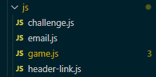
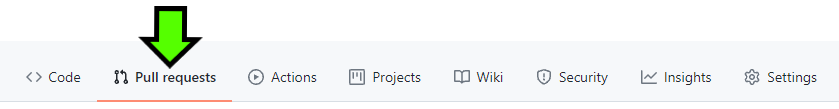

# Portfolio Project 2 - JavaScript


*A gentle reminder to all - to open links in a new tab, hold 'Ctrl' (or '⌘' on Apple devices) as you click!*

## Live Site

[Mastermind - A Logic Game](https://daveyjh.github.io/ci-portfolio-two)

## Repository

[https://github.com/daveyjh/ci-portfolio-two](https://github.com/daveyjh/ci-portfolio-two)

***

## Table of Contents

- [Portfolio Project 2 - JavaScript](#portfolio-project-2---javascript)
  - [Live Site](#live-site)
  - [Repository](#repository)
  - [Table of Contents](#table-of-contents)
  - [Objective](#objective)
  - [Brief](#brief)
    - [Mastermind - A Logic Game](#mastermind---a-logic-game)
  - [UX - User Experience Design](#ux---user-experience-design)
    - [User Requirements](#user-requirements)
    - [Initial Concept](#initial-concept)
      - [Wireframes](#wireframes)
      - [Colour Scheme](#colour-scheme)
      - [Typography](#typography)
      - [Imagery](#imagery)
  - [Features](#features)
    - [Existing Features](#existing-features)
    - [Features Left to Implement](#features-left-to-implement)
  - [Technologies Used](#technologies-used)
    - [VSCode Extensions](#vscode-extensions)
  - [Testing](#testing)
    - [W3C Validator](#w3c-validator)
      - [HTML](#html)
      - [CSS](#css)
    - [Wave](#wave)
    - [JSHint](#jshint)
    - [Lighthouse Testing](#lighthouse-testing)
      - [Mobile](#mobile)
      - [Desktop](#desktop)
  - [Bugs](#bugs)
    - [Current](#current)
    - [Resolved](#resolved)
  - [Development](#development)
    - [GitHub](#github)
    - [VSCode](#vscode)
      - [Cloning](#cloning)
      - [Extensions](#extensions)
      - [Editing](#editing)
  - [Deployment](#deployment)
    - [Github Pages](#github-pages)
    - [Forking](#forking)
  - [Credits](#credits)
    - [Content](#content)
    - [Media](#media)
    - [Acknowledgements](#acknowledgements)
  - [Personal Development](#personal-development)
    - [Accessibility](#accessibility)
    - [JavaScript Structure](#javascript-structure)
    - [GitHub Project Board and Issues](#github-project-board-and-issues)

***

## Objective

Design an interactive Mastermind game using JavaScript. The project should
demonstrate competency with HTML, CSS and JavaScript.

***The needs within this project are not genuine and are made purely for the
purpose of completing my Code Institute project.***

***

## Brief

### Mastermind - A Logic Game

The goal of this website is to provide an interactive version of the classic
Mastermind game. The site should have:

- an emotive and enjoyable, interactive Mastermind game written using JavaScript
- a few difficulty options and settings
- the rules of the game for those who have not played before
- a brief intro and link to me as a developer
- a consistent layout and design

***

## UX - User Experience Design

### User Requirements

Some example user stories which will affect the design:

> *"As a person who enjoys Mastermind, I want to get straight into playing the
  game. I have played other versions and find them a little aesthetically dull"*
>
> *"As a person who hasn't played before, I would like to read the rules of the
  game. I want to know exactly how to play and what to expect"*
>
> *"As a person that likes a challenge, I would like the option of a more
  difficult game"*
>
> *"As an interested developer/employer, I would like to learn more about the
  developer of this site"*

***

### Initial Concept

I hope to provide a fully functioning version of the Mastermind game using
JavaScript, HTML and CSS. I anticipate using a wooden colour scheme, perhaps with
photographic textures, to add a little more style than some versions I have
researched. The site should be simple to navigate, not allow errors during use
and encourage users to play at increasing difficulty levels. The application is
to be designed with 'mobile first' in mind.

**The design process is detailed in more depth in the
[design-notes](./readme-content/design-notes.md) document.**

***

#### Wireframes


*See [here](./readme-content/wireframes.md) for all mobile pages and other device
types*

***

#### Colour Scheme

With the game board of the site designed with a wood style background, I used
[instant eyedropper](#technologies-used) to obtain a couple of colours from the
wood photographs.  I then used [coolors.co](https://coolors.co) to generate a
colour scheme.  
  
The header uses the darkest colour from the scheme to contrast with the game
board and allow a high contrast with the text colour. The main text content
displayed in the rest of the site is set on a wood colour to maintain the style
throughout. There are a few more sections with the dark colour background within
the main site, these are highlighting calls-to-action, and the higher contrast
helps to identify this.

Contrast checks have been carried out with the WebAIM
[contrast checker](https://webaim.org/resources/contrastchecker/) with regards to
all main text content. I suspect the footer element is less likely to give a good
result but I do not wish to detract from the site content and am happy to leave
it this way.
***

#### Typography

The fonts used for the site are
[Orbitron](https://fonts.google.com/specimen/Orbitron) and
[Rajdhani](https://fonts.google.com/specimen/Rajdhani) from google fonts.

- **Orbitron** has been chosen as it has a geometric look that lends itself well
to the content and feel of the site. It has been used for the main heading and
the nav
elements, all utilising the small-caps font variant.  
- **Rajdhani** has been chosen for the main text content of the site. The squared
styling fits well with the Orbitron font and allows for a pleasant visual
appearance with its slightly rounded corners.

***

#### Imagery

There are not many images in the site. The split brain image in the header
represents the colours of the game and the logic behind it. The repeating balls
used as a background on the pages are there to break up the blank space behind
sections. The favicon looks like it could be a side on version of the
header image.  
All the rules images are screenshot snips made using
[Windows Snipping Tool](#technologies-used) and are taken from the finished
design of the game. The image on the about page is me, taken using a
[Samsung Galaxy S8](https://www.samsung.com/uk/smartphones/galaxy-s8/). All
other images were made using
[Paint3D](#technologies-used).

All images have been converted to webp format using
[cloudconvert](https://cloudconvert.com/).

***

## Features

### Existing Features

<!-- - Feature 1 - allows users X to achieve Y, by having them fill out Z -->
<!-- 1. feature1
>*"User... **story quote**"*
- *explanation*-->
F1

***

<!-- - Feature 2 - allows users X to achieve Y, by having them fill out Z -->
<!-- 1. feature2
>*"User... **story quote**"*
- *explanation*
  
-->
F2

***

### Features Left to Implement

<!-- features left to implement -->
<!-- 1. Explain desired feature 1
  - *Notes regarding feature*
  - Explanation of feature need etc. -->
<!-- 2. Explain desired feature 2
  - *Notes regarding feature*
  - Explanation of feature need etc. -->

***

## Technologies Used

<!-- tech used -->
<!-- - *[techNameOne](techURL)*
       - Description -->
<!-- - *[techNameTwo](techURL)*
       - Description -->

- *[Instant Eyedropper](http://instant-eyedropper.com/)*
  - A quick and simple application to obtain hex values from any colour on my
  display. I downloaded this while playing around with my laptop layout/display
  settings. I have the app set to run on startup and remain minimized in my
  system tray. This allows quick access and if I click the colour, it
  automatically copies the value to my clipboard.
- *[WebAIM Contrast Checker](https://webaim.org/resources/contrastchecker/)*
  - A basic contrast checking service for conformity to the Web Content
  Accessibility Guidelines. The service allows input of a foreground and
  background colour and displays the resulting contrast ratio, including a quick
  reference to meeting WCAG AA / AAA standards.
- *[Windows Snipping Tool](https://support.microsoft.com/en-us/windows/use-snipping-tool-to-capture-screenshots-00246869-1843-655f-f220-97299b865f6b)*
  - A screenshot tool built in to Windows. It allows quick, partial screen shots
  to be taken that can be saved as image files.
- *[Paint3D](https://www.microsoft.com/en-gb/p/paint-3d/9nblggh5fv99?activetab=pivot:overviewtab)*
  - Free software on Windows, allowing image editing and creation.
- *[EmailJS](https://www.emailjs.com/)*
  - An email client API that allows custom emails to be sent via a mix of HTML forms and JavaScript.
- *[JSHint](https://jshint.com/)*
  - A static code analysis tool for JavaScript. [Results here](#jshint).
- *[Balsamiq](https://balsamiq.com/)*
  - Balsamiq was used to create [wireframes](./readme-content/wireframes.md)
  for the project.
- *[CloudConvert](https://cloudconvert.com/)*
  - All images within the project have been processed through their free file
  converter service
- *[Font Awesome](https://fontawesome.com/)*
  - The project uses icons from Font Awesome version 5.
- *[Coolors.co](https://coolors.co)*
  - The colour scheme, and subsequent shades and tones, were generated via this
  application.
- *[Chrome DevTools](https://developer.chrome.com/docs/devtools/)*
  - Once the website was made to a basic deployment level, this extension
  featured heavily as I modified sizings and spacings.
- *[Google Fonts](https://fonts.google.com/)*
  - The fonts used in the website are imported from Google Fonts.
- *[Multi Device Mockup Generator](https://techsini.com/multi-mockup/index.php)*
  - The image at the top of this document was created using a free service
  provided by TechSini.&#8203;com
- *[WebAIM Contrast Checker](https://webaim.org/resources/contrastchecker/)*
  - A contrast checker to test WCAG levels.
- *[Wave Web Accessibility Evaluation Tool](https://wave.webaim.org/)*
  - A tool to check for errors with accessibility. [Results here](#wave).
- *[W3C Markup Validation Service](validator.w3.org)*
  - A service to check the HTML and CSS files for errors. During
  development, I copied the entire text from the files and ran them through the
  direct input method. Upon completion, I ran the deployed site through the
  'Validate by URI' method with [results here](#w3c-validator).
- *[Visual Studio Code](https://code.visualstudio.com/)*
  - A free, streamlined code editor. The [extensions](#vscode-extensions)
  available have allowed me to customize my workspace and become more
  efficient.

***

### VSCode Extensions

Links to website of each extension provided

- [Beautify](https://marketplace.visualstudio.com/items?itemName=HookyQR.beautify)
- [Better Comments](https://marketplace.visualstudio.com/items?itemName=aaron-bond.better-comments)
- [Bracket Pair Colorizer 2](https://marketplace.visualstudio.com/items?itemName=CoenraadS.bracket-pair-colorizer-2)
- [GitHub Pull Request and Issue Provider](https://marketplace.visualstudio.com/items?itemName=GitHub.vscode-pull-request-github)
- [Highlight Matching Tag](https://marketplace.visualstudio.com/items?itemName=vincaslt.highlight-matching-tag)
- [Markdown All in One](https://marketplace.visualstudio.com/items?itemName=yzhang.markdown-all-in-one)
- [markdownlint](https://marketplace.visualstudio.com/items?itemName=DavidAnson.vscode-markdownlint)
- [Preview on Web Server](https://marketplace.visualstudio.com/items?itemName=yuichinukiyama.vscode-preview-server)
- [jshint](https://marketplace.visualstudio.com/items?itemName=dbaeumer.jshint)

***

## Testing

I utilised the console in devTools for some of the testing. This allowed me to
check solutions without having to work them out, add rows without making 99
attempts and see stages of my JavaScript by using `console.log()`.

``` JavaScript
//! delete before deployment
/** for testing
 * * testAddRows();
 * * aR = 97;
 * - complete first row (number border will remain)
 * - complete last row (99)
 */
function testAddRows() {
  while (guessRows.length < 98) {
    addRow();
  }
}
```

I used `ar = (97);` and `testAddRows()` to test the `extremeLoss` conditions.

***

- Testing of internal and external links was done manually. All links directed
  to the intended location in the correct manor.
- The challenge and default index settings were tested manually with all
  results as expected:
  - Empty colour balls were selected and checked for functionality.
  - Intended colours were selected and checked for correct placement.
  - Colour balls with colours alrady chosen were selected to ensure operation
    of the clear selector.
  - Rows were completed to ensure the check result icon displayed.
  - Completed rows had a colour cleared to ensure the check result icon
    disappeared.
  - `console.log(solution)` was used while checking correct result peg operation.
  - Results we checked with all possible outcomes (number of white and black
    pegs).
  - The game was completed in various times, using various numbers of rows, to
    ensure correct function of the best score and time.
  - The challenge was unsuccessful after 6 rows to ensure the loss condition
    worked correctly.
  - The index game was unsuccessful after 7 rows to ensure new rows were addded
    correctly.
  - The colour blind option was selected and tested.
  - The audio option was selected and tested for all audio instances.
  - A screen reader was used to test all aria text and functions.
  - The index settings were modified to test the correct operation and
    disablement of the checkboxes.
  - The pause function of the current timer was tested by opening the settings
    overlay.
  - The score and timer settings were tested on new games and by closing the
    settings overlay.
  - The hint and give up icons were tested at various stages of the game to
    ensure correct function.
  - The confirmation alerts were tested for positive and negative inputs.
  - The text below the gameboard was checked in win and loss conditions.
- The contact form was tested:
  - Without a 'Name', 'Email' and 'Message' entry to ensure `required` was
    applied to the correct elements.
  - Without a 'GitHub' entry to ensure this was not requird.
  - With various 'GitHub' styles to ensure the string modification worked
    correctly:
    - `@Test`
    - `github.com/test`
    - `test`
    - `https://github.com/test`
  - By attempting to write a message longer than 250 characters.
- An example of the input and result:  
  
  
- The site was tested on multiple devices and browsers with all results as expected.

***

### W3C Validator

#### HTML

- [Index](https://validator.w3.org/nu/?doc=https%3A%2F%2Fdaveyjh.github.io%2Fci-portfolio-two%2F)
- [Challenge](https://validator.w3.org/nu/?doc=https%3A%2F%2Fdaveyjh.github.io%2Fci-portfolio-two%2Fchallenge)
- [Rules](https://validator.w3.org/nu/?doc=https%3A%2F%2Fdaveyjh.github.io%2Fci-portfolio-two%2Frules)
- [About](https://validator.w3.org/nu/?doc=https%3A%2F%2Fdaveyjh.github.io%2Fci-portfolio-two%2Fabout)

There is a warning on the challenge page regarding a `section` without a heading.
The section contains the gameboard and I am happy to leave it this way.


There is a warning on the about page regarding a second `h1` element. The
heading sits within an `article` and appears to be an acceptable practice.
[See here for reference](https://html.spec.whatwg.org/multipage/sections.html#headings-and-sections).


***

#### CSS

- [Index](http://jigsaw.w3.org/css-validator/validator?uri=https%3A%2F%2Fdaveyjh.github.io%2Fci-portfolio-two%2F&profile=css3svg&usermedium=all&warning=1&vextwarning=&lang=en)
- [Challenge](http://jigsaw.w3.org/css-validator/validator?uri=https%3A%2F%2Fdaveyjh.github.io%2Fci-portfolio-two%2Fchallenge&profile=css3svg&usermedium=all&warning=1&vextwarning=&lang=en)
- [Rules](http://jigsaw.w3.org/css-validator/validator?uri=https%3A%2F%2Fdaveyjh.github.io%2Fci-portfolio-two%2Frules&profile=css3svg&usermedium=all&warning=1&vextwarning=&lang=en)
- [About](http://jigsaw.w3.org/css-validator/validator?uri=https%3A%2F%2Fdaveyjh.github.io%2Fci-portfolio-two%2Fabout&profile=css3svg&usermedium=all&warning=1&vextwarning=&lang=en)

<!-- todo add warnings -->

***

### Wave

- [Index](https://wave.webaim.org/report#/daveyjh.github.io/ci-portfolio-two)
- [Challenge](https://wave.webaim.org/report#/https://daveyjh.github.io/ci-portfolio-two/challenge.html)
- [Rules](https://wave.webaim.org/report#/https://daveyjh.github.io/ci-portfolio-two/rules.html)
- [About](https://wave.webaim.org/report#/https://daveyjh.github.io/ci-portfolio-two/about.html)

No errors are reported on any of the pages. There are multiple alerts for font
sizes, however these are for screen readers so I am happy leaving them in
place.

***

### JSHint

No errors are reported by JSHint. There are 3 warnings reported in the
JavaScript files.



The warnings refer to functions that reference outer scoped variables and
functions. This could be resoved by re-declaring the variables and functions
within the function, but seems an unecessary step as variables are
descriptively named and docstrings are present for functions.


***

### Lighthouse Testing

#### Mobile


Performance and SEO scores could be a little higher.

The image used for the background of the gameboard is delayed by some of the
third party stylesheets and could be re-designed to use linear-gradients.
I tested this with commit
[966c35d](https://github.com/DaveyJH/ci-portfolio-two/commit/966c35dc37284515b13802ff1f7abd5d46c007e5)
but found the style was not suitable. The slight difference in performance score
did not warrant a reduction in UX.


The maximum cache time is set by GitHub pages at 10 minutes. This also reduces
the performance score and is beyond my control.


*[Reference](https://webapps.stackexchange.com/questions/119286/caching-assets-in-website-served-from-github-pages)*

SEO scores are affected by the small font size applied to screen reader
assistive text.


***

#### Desktop


All scores are green and highly satisfactory.

***

## Bugs

### Current

<!-- current bugs -->
1. When playing the game on a mobile device and having the 'Colour Blind' setting
   enabled, the tooltip remains above the ball that is selected for a colour
   selection.


*The bug is due to the `.blur()` method not working as intended on touch screen
devices. I investigated ways to resolve this but found the impact on UX to be
so minimal it did not warrant the time spent on it.*

***

### Resolved

1. When playing the game an error was generated in the console once line 99 had
  been attempted. Two errors were causing this:


*Commit - [bd06f93](https://github.com/DaveyJH/ci-portfolio-two/commit/bd06f93#diff-ce75dc990f41e122d063d10b3068e250494e1ca2ac80fa8a3bf62a618de01277R853) -
Corrected second line in **extremeLoss()** to correctly target the **hintIcon**.*


*Commit - [bd06f93](https://github.com/DaveyJH/ci-portfolio-two/commit/bd06f93#diff-ce75dc990f41e122d063d10b3068e250494e1ca2ac80fa8a3bf62a618de01277R938) -
Added to line in **reset()** to prevent **deactivateRow()** when **aR** was equal
to or greater than **98**.*

***

2. If the settings menu was opened with a keyboard and the focus jumped to the
  first button, the button would trigger. This revealed a number of other issues:


*Commit - [2e48239](https://github.com/DaveyJH/ci-portfolio-two/commit/2e48239#diff-ce75dc990f41e122d063d10b3068e250494e1ca2ac80fa8a3bf62a618de01277R1010) -
Changed **keydown** in addEventListener to **keyup**.
I was made aware of this by [SiJiL82](https://github.com/sijil82) after posing a
question regarding the bug in the [Code Institute](https://codeinstitute.net/)
Slack community. Thanks Sven!  
This made me realise many of my functions would be made better with **keyup** to
try and prevent bad UX in the case of users with slower motor skills.*

***

3. Custom styled checkboxes were not giving good UX when disabled:


*I spent a lot of time looking over various methods to resolve this issue.
The main issue is for accessibility, being that a disabled checkbox is
effectively removed from the DOM. This causes a bad UX for users with
specialised controls and screen readers. After many attempts, I realised I
could have achieved the intended result with fewer lines of code but I am happy
with the logic that is being applied to my solution.*

***

4. Links to element `id`s were not responding as expected on larger screens:


*Commit - [8a50740](https://github.com/DaveyJH/ci-portfolio-two/commit/8a5074004e65263c1527115faf14e13a60372a0d) -
Added JavaScript and extra spans to dynamically change `href` values.  
When clicking on an internal link on a large screen, the top of the destination
was overlayed by the header. This was due to `position: sticky` and was overcome
by use of some positioned elements with a similar id to the target and a small
JavaScript file to calculate if the destination should be modified.*

***

5. When playing with more than 4 balls in the solution, if a new row was
  created, the balls would not be re-sized:


*Commit - [e762e7a](https://github.com/DaveyJH/ci-portfolio-two/commit/e762e7a998e7352218b6afb626e1a08a90a1ed7e) -
Added `resizeBalls()` to `addRow()`*

***

6. With 'Colour Blind' active, it was possible to tap just outside the ball
  to bring up the tooltip without activating the button:


*Commit - [915aded](https://github.com/DaveyJH/ci-portfolio-two/commit/915aded43b0bf6734d111516feefd024396980e3) -
Modified `.tooltip-holer` to have `border-radius: 50%`.

***

7. Tooltips and aria text was not updating when using a hint:


*Issue [#17](https://github.com/DaveyJH/ci-portfolio-two/issues/17) -
Modified `addOneSolutionColor()` and found `setSolutionBallCount()` needed an
extra loop to set the original ball text.*

***

## Development

<!-- section missed in first project. 
!describe development process (github/vscode) -->

The site was made utilising [GitHub](#GitHub) and [VSCode](#VSCode)

### GitHub

[GitHub Website](https://github.com)

- Sign in to GitHub
- I use a template that contains a template of my README file which can be
  accessed [here](https://github.com/DaveyJH/template) and is available
  public use via the **Use this template** button


- Click  and select
- **New** from the panel on the left, next to **Repositories**


- Select the template you wish to use


- Give the repository a name and description and then click **Create repository**


The repository has now been created and is ready for editing

***

### VSCode

[VSCode Website](https://code.visualstudio.com/)

For general information on using GitHub with VSCode see their documentation [here](https://code.visualstudio.com/docs/editor/github).  
*This section assumes you have successfully linked your GitHub account to the
application*

#### Cloning

- Open the command panel using your keyboard shortcut or **View** > **Command
  Palette...**


- With the command palette open, type *clone* and click **Git: Clone** and then
  **Clone from
  GitHub**


- Type the GitHub username followed by / and the repository you wish to work on


- Click the repository from the drop-down list and save it in a local directory
- of your choosing

The repository is now ready for development

#### Extensions

Once the repository is open within VSCode, there are many extensions and aids
that can assist with your development process. This is a list of extensions I use
with a brief description of the main functions I utilise

- [Beautify](#VSCode-Extensions) -  Auto-formatting of files
- [Better Comments](#VSCode-Extensions) - Colour comments for easier
  identification
- [Bracket Pair Colorizer 2](#VSCode-Extensions) - Colours nested brackets and
  sequential brackets for more efficient workflow
- [GitHub Pull Request and Issue Provider](#VSCode-Extensions) - Allows better
  integration with GitHub
- [Highlight Matching Tag](#VSCode-Extensions) - Highlights paired tag for more
  efficient workflow
- [Markdown All in One](#VSCode-Extensions) - Auto updates contents section and
  other efficiency features when writing markdown documents
- [markdownlint](#VSCode-Extensions) - Highlights errors and best practices with
  markdown documents
- [Preview on Web Server](#VSCode-Extensions) - Allows live webserver with
  keyboard shortcut

#### Editing

- The explorer tab enables viewing of the files within the repository


- Open files from the explorer tab in the editor window and perform changes as
  necessary


- Save files as appropriate, add, commit and push them. There are multiple ways
  to do this
  - VSCode Source Control
    - Select the **Source Control** tab that looks like a repository branch

    

    - Click the **+** sign next to files you wish to add to staged changes

    

    - Type a commit message and click the tick icon to commit

    

    - When ready to push your repository back to GitHub click the push/pull icon
      in the bar at the bottom of the application
  
    

    - *I have many keyboard shortcuts set to speed up this process, they are
      configurable within the VSCode settings*

  - Terminal  
  *These steps assume you are in the root directory of your repository and typing
  in the terminal*
    - Type `git add .` and press Enter to add all modified or untracked file

    

    - Type `git add fileNameHere.extension assets/anotherFileHere.extension` and
      press Enter to add specific files, remembering to include sub-directories
      where necessary
  
    

    - Type `git commit -m "meaningful message here"` to commit your staged files
      with the typed commit message

    

    - Type `git push` to push your repository to the remote repository held at
    GitHub

    

    - *There are many other stages to editing, such as branches, git stash,
      reverting commit messages and others. For more information,
      refer to the [git documentation](https://git-scm.com)*

***

## Deployment

### Github Pages

- Navigate to the relevant GitHub Repository
  [here](https://github.com/daveyjh/ci-portfolio-two)
- Select **Settings** from the options below the name of the repository


- Select **Pages** from the left-hand menu


- Select **Branch: main** as the source and leave the directory as **/(root)**


- Click the **Save** button

- Take note of the URL provided


- GitHub takes a short while to publish the page.
  The bar turns green if you refresh the pages tab and the page has been deployed


- Click the link or copy the URL to a browser to reach the deployed page

**[https://daveyjh.github.io/ci-portfolio-two/](https://daveyjh.github.io/ci-portfolio-two/)**

The site is now live and operational

### Forking

If you wish to contribute to the site, this is most simply achieved by forking
the repository.

- Head over to [GitHub](https://github.com) and log in.
- Search my username and repository in the bar provided
  


- Select the repository
- Click the fork icon in the top right


- This creates a fork within your GitHub repositories
- Edit the files as necessary using your preferred method
- Add, commit and push your changes to your remote repository using your
  preferred method
- In your repository on GitHub select **Pull Requests**



- Click **New Pull Request**


- Check the details of the pull request and then click **Create pull request**


- Add a message explaining what your pull request adds to the repository and complete with **Create pull request**


I will receive the pull request and action it accordingly.

***

## Credits

### Content

- Thanks to [Donald Knuth](https://www-cs-faculty.stanford.edu/~knuth/index.html)
for his algorithm information

### Media

- The favicon image and header image are license free, obtained from
  [Pixabay](https://pixabay.com/)  
- The audio content is license free and comes from
  [ZapSplat](https://www.zapsplat.com/)

### Acknowledgements

<!-- - acknowledge a, found at [b](bURL), for c -->
<!-- - acknowledge d, found at [e](eURL), for f -->

***

## Personal Development

### Accessibility

I would like to learn more about accessibility requirements. I feel I have a
good understanding of some of the basics, however, I do not have enough knowledge
of what various users would expect as 'normal behaviour'. As an addition to this,
I should try and maintain designing things with more accessibility in mind at the
initial stages.

### JavaScript Structure

During this project, I have learned about many ways of working with JavaScript.
One key aspect is the capability to pass variables and functions around a script.
I have not utilised this enough in this project and will strive to design my
future projects differently to allow less verbose code structures.
Another point to consider is file size. Although I am comfortable with reading
through my own code and have separated it into smaller functions, it does not lend
itself to good readability and general maintenance. I hope to segregate my
functions into relevant files in future projects.

### GitHub Project Board and Issues

I took part in a hackathon event with a great team during the development of this
site. I found the tracking, and work flow assistance that can be provided from
it, to be very useful. I did not think to implement it on my own, solo project
until very late in the development stages. In future projects, I intend to
utilise the features far more often and to greater effect.
