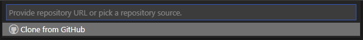

# Portfolio Project 2 - JavaScript
<!--  -->

*A gentle reminder to all - to open links in a new tab, hold 'Ctrl' (or '⌘' on Apple devices) as you click!*

## Live Site

[Mastermind - A Logic Game](https://daveyjh.github.io/ci-portfolio-two)

## Repository

[https://github.com/daveyjh/ci-portfolio-two](https://github.com/daveyjh/ci-portfolio-two)
***

## Table of Contents

- [Portfolio Project 2 - JavaScript](#portfolio-project-2---javascript)
  - [Live Site](#live-site)
  - [Repository](#repository)
  - [Table of Contents](#table-of-contents)
  - [Objective](#objective)
  - [Brief](#brief)
    - [Mastermind - A Logic Game](#mastermind---a-logic-game)
  - [UX - User Experience Design](#ux---user-experience-design)
    - [User Requirements](#user-requirements)
    - [Initial Concept](#initial-concept)
      - [Wireframes](#wireframes)
      - [Colour Scheme](#colour-scheme)
      - [Typography](#typography)
      - [Imagery](#imagery)
  - [Features](#features)
    - [Existing Features](#existing-features)
    - [Features Left to Implement](#features-left-to-implement)
  - [Technologies Used](#technologies-used)
    - [VSCode Extensions](#vscode-extensions)
  - [Testing](#testing)
  - [Bugs](#bugs)
    - [Current](#current)
    - [Resolved](#resolved)
  - [Development](#development)
    - [GitHub](#github)
    - [VSCode](#vscode)
      - [Cloning](#cloning)
      - [Extensions](#extensions)
      - [Editing](#editing)
  - [Deployment](#deployment)
    - [Github Pages](#github-pages)
    - [Forking](#forking)
  - [Credits](#credits)
    - [Content](#content)
    - [Media](#media)
    - [Acknowledgements](#acknowledgements)
    - [Personal Development](#personal-development)

***

## Objective

Design an interactive Mastermind game using JavaScript. The project should demonstrate competency with HTML, CSS and JavaScript.

***The needs within this project are not genuine and are made purely for the purpose of completing my Code Institute project***

***

## Brief

### Mastermind - A Logic Game

The goal of this website is to provide an interactive version of the classic Mastermind game. The site should have:

- an emotive and enjoyable, interactive Mastermind game written using JavaScript
- a few difficulty options and settings
- the rules of the game for those who have not played before
- a brief intro and link to me as a developer
- a consistent layout and design

***

## UX - User Experience Design

### User Requirements

Some example user stories which will affect the design:

> *"As a person who enjoys Mastermind, I want to get straight into playing the game. I have played other versions and find them a little aesthetically dull"*
>
> *"As a person who hasn't played before, I would like to read the rules of the game. I want to know exactly how to play and what to expect"*
>
> *"As a person that likes a challenge, I would like the option of a more difficult game"*
>
> *"As an interested developer/employer, I would like to learn more about the developer of this site"*

***

### Initial Concept

I hope to provide a fully functioning version of the Mastermind game using JavaScript, HTML and CSS. I anticipate using a wooden colour scheme, perhaps with photographic textures, to add a little more style than some versions I have researched. The site should be simple to navigate, not allow errors during use and encourage users to play at increasing difficulty levels. The application is to be designed with 'mobile first' in mind.

The design process is detailed in more depth in the [design-notes](./readme-content/design-notes.md) document.

#### Wireframes

*See [here](./readme-content/wireframes.md) for all mobile pages and other device types*

***

#### Colour Scheme

<!-- colour scheme, remember to contrast check!!! -->

With the game board of the site designed with a wood style background, I used [instant eyedropper](#technologies-used) to obtain a couple of colours from the wood photographs.  I then used [coolors.co](https://coolors.co) to generate a colour scheme.  
  
The header uses the darkest colour from the scheme to contrast with the game board and allow a high contrast with the text colour. The main text content displayed in the rest of the site is set on a wood colour to maintain the style throughout. There are a few more sections with the dark colour background within the main site, these are highlighting calls-to-action, and the higher contrast helps to identify this.

Contrast checks have been carried out with the WebAIM [contrast checker](https://webaim.org/resources/contrastchecker/) with regards to all main text content. I suspect the footer element is less likely to give a good result but I do not wish to detract from the site content and am happy to leave it this way.
***

#### Typography

<!-- typography -->

The font used for the site are [Orbitron](https://fonts.google.com/specimen/Orbitron) and [Rajdhani](https://fonts.google.com/specimen/Rajdhani) from google fonts.  
Orbitron has been chosen as it has a geometric look which lends itself well to the content and feel of the site. It has been used for the main heading and the nav elements, all utilising the small-caps font variant.  
Rajdhani has been chosen for the main text content of the site. The squared styling fits well with the Orbitron font and allows for a pleasant visual appearance with its slightly rounded corners.
***

#### Imagery

<!-- imagery -->

***

## Features

### Existing Features

<!-- - Feature 1 - allows users X to achieve Y, by having them fill out Z -->
<!-- 1. feature1
>*"User... **story quote**"*
- *explanation*-->
F1

***

<!-- - Feature 2 - allows users X to achieve Y, by having them fill out Z -->
<!-- 1. feature2
>*"User... **story quote**"*
- *explanation*
  
-->
F2

***

### Features Left to Implement

<!-- features left to implement -->
<!-- 1. Explain desired feature 1
  - *Notes regarding feature*
  - Explanation of feature need etc. -->
<!-- 2. Explain desired feature 2
  - *Notes regarding feature*
  - Explanation of feature need etc. -->

***

## Technologies Used

<!-- tech used -->
<!-- - *[techNameOne](techURL)*
       - Description -->
<!-- - *[techNameTwo](techURL)*
       - Description -->

- *[Instant Eyedropper](http://instant-eyedropper.com/)*
  - A quick and simple application to obtain hex values from any colour on my display. I downloaded this while playing around with my laptop layout/display settings. I have the app set to run on startup and remain minimized in my system tray. This allows quick access and if I click the colour, it automatically copies the value to my clipboard.
- *[WebAIM Contrast Checker](https://webaim.org/resources/contrastchecker/)*
  - A basic contrast checking service for conformity to the Web Content Accessibility Guidelines. The service allows input of a foreground and background colour and displays the resulting contrast ratio, including a quick reference to meeting WCAG AA / AAA standards.

### VSCode Extensions

Links to website of each extension provided

- [Beautify](https://marketplace.visualstudio.com/items?itemName=HookyQR.beautify)
- [Better Comments](https://marketplace.visualstudio.com/items?itemName=aaron-bond.better-comments)
- [Bracket Pair Colorizer 2](https://marketplace.visualstudio.com/items?itemName=CoenraadS.bracket-pair-colorizer-2)
- [GitHub Pull Request and Issue Provider](https://marketplace.visualstudio.com/items?itemName=GitHub.vscode-pull-request-github)
- [Highlight Matching Tag](https://marketplace.visualstudio.com/items?itemName=vincaslt.highlight-matching-tag)
- [Markdown All in One](https://marketplace.visualstudio.com/items?itemName=yzhang.markdown-all-in-one)
- [markdownlint](https://marketplace.visualstudio.com/items?itemName=DavidAnson.vscode-markdownlint)
- [Preview on Web Server](https://marketplace.visualstudio.com/items?itemName=yuichinukiyama.vscode-preview-server)

## Testing

<!-- explain testing
? item tested
? expected result
? how test was performed
? actual result
? differences
? action required
? re-test
- more detail and better format required compared with project 1
look at daisy's testing documentation and [webinar](https://us02web.zoom.us/rec/play/9FIKllHX2ZiQNFRhYPn_hBh_ZeA8964ZvIDLnhpKGAf1NLVc3_hBJ6zSL8Hv5Hx7ALnPtDmbg8CmFAs.YVsZ9LR_uI7OjEwH)-->

<!-- validation of html, css and script. -->
<!-- lighthouse testing -->

## Bugs

### Current

<!-- current bugs -->

<!-- - bugOne explanation

*notes on explanation* -->

***

<!-- - bugTwo explanation

*notes on explanation* -->

***

### Resolved

<!-- when resetting from extreme loss, error occurred
resolved with extra check in reset -->

<!-- when opening settings overlay with keyboard and having focus jump to minus button
the value would decrease. Sven Lowry_5P  -->

<!-- resolved bugs -->
<!-- 1. bugOne

*Commit - **[sha](commit link with highlighted lines)** - explanation of fix* -->

***

<!-- 1. bugTwo

*Commit - **[sha](commit link with highlighted lines)** - explanation of fix* -->

***

## Development

<!-- section missed in first project. 
!describe development process (github/vscode) -->

The site was made utilising [GitHub](#GitHub) and [VSCode](#VSCode)

### GitHub

[GitHub Website](https://github.com)

- Sign in to GitHub
- I use a template that contains a template of my README file which can be
  accessed [here](https://github.com/DaveyJH/template) and is available 
  public use via the **Use this template** button

- Click  and select **New** from the panel on the left, next to **Repositories**

- Select the template you wish to use

- Give the repository a name and description and then click **Create repository**

The repository has now been created and is ready for editing

### VSCode

[VSCode Website](https://code.visualstudio.com/)

For general information on using GitHub with VSCode see their documentation [here](https://code.visualstudio.com/docs/editor/github).  
*This section assumes you have successfully linked your GitHub account to the application*

#### Cloning

- Open the command panel using your keyboard shortcut or **View** > **Command Palette...**

- With the command palette open, type *clone* and click **Git: Clone** and then **Clone from GitHub**

- Type the GitHub username followed by / and the repository you wish to work on

- Click the repository from the drop down list and save in a local directory of your choosing

The repository is now ready for development

#### Extensions

Once the repository is open within VSCode, there are many extensions and aids that can assist with your development process. This is a list of extensions I use with a brief description of the main functions I utilise

- [Beautify](#VSCode-Extensions) -  Auto-formatting of files
- [Better Comments](#VSCode-Extensions) - Colour comments for easier identification
- [Bracket Pair Colorizer 2](#VSCode-Extensions) - Colours nested brackets and sequential brackets for more efficient workflow
- [GitHub Pull Request and Issue Provider](#VSCode-Extensions) - Allows better integration with GitHub
- [Highlight Matching Tag](#VSCode-Extensions) - Highlights paired tag for more efficient workflow
- [Markdown All in One](#VSCode-Extensions) - Auto updates contents section and other efficiency features when writing markdown documents
- [markdownlint](#VSCode-Extensions) - Highlights errors and best practices with markdown documents
- [Preview on Web Server](#VSCode-Extensions) - Allows live webserver with keyboard shortcut

#### Editing

- The explorer tab enables viewing of the files within the repository

- Open files from the explorer tab in the editor window and perform changes as necessary

- Save files as appropriate, add, commit and push them. There are multiple ways to do this
  - VSCode Source Control
    - Select the **Source Control** tab that looks like a repository branch

    

    - Click the **+** sign next to files you wish to add them to staged changes (add)

    

    - Type a commit message and click the tick icon to commmit

    

    - When ready to push your repository back to GitHub click the push/pull icon in the bar at the bottom of the application
  
    

    - *I have many keyboard shortcuts set to speed up this process, they are configurable within the VSCode settings*

  - Terminal  
  *These steps assume you are in the root directory of your repository and typing in the terminal*
    - Type `git add .` and press Enter to add all modified or untracked file

    

    - Type `git add fileNameHere.extension assets/anotherFileHere.extension` and press Enter to add specific files, remembering to include sub-directories where necessary
  
    

    - Type `git commit -m "meaningful message here"` to commit your staged files with the typed commit message

    

    - Type `git push` to push your repository to the remote repository held at GitHub

    

    - *There are many other stages to editing such as branches, git stash,
    reverting commit messages and others. For more information,
    refer to the [git documentation](https://git-scm.com)*

## Deployment

### Github Pages

- Navigate to the relevant GitHub Repository [here](https://github.com/daveyjh/ci-portfolio-two)
- Select **Settings** from the options below the name of the repository

- Select **Pages** from the left hand menu

- Select **Branch: main** as the source and leave the directory as **/(root)**

- Click the **Save** button

- Take note of the URL provided

- GitHub takes a short while to publish the page.
  The bar turns green if you refresh the pages tab and the page has been deployed

- Click the link or copy the URL to a browser to reach the deployed page

**[https://daveyjh.github.io/ci-portfolio-two/](https://daveyjh.github.io/ci-portfolio-two/)**

The site is now live and operational

### Forking

If you wish to contribute to the site, this is most simply achieved by forking the repository.

- Head over to [GitHub](https://github.com) and log in.
- Search my username and repository in the bar provided
  

- Select the repository
- Click the fork icon in the top right

- This creates a fork within your GitHub repositories
- Edit the files as necessary using your preferred method
- Add, commit and push your changes to your remote repository using your preferred method
- In your repository on GitHub select **Pull Requests**

- Click **New Pull Request**

- Check the details of the pull request and then click **Create pull request**

- Add a message explaining what your pull request adds to the repository and complete with **Create pull request**

I will recieve the pull request and action it accordingly

***

## Credits

### Content

<!-- - the a comes from b -->
<!-- - the c comes from d -->

### Media

<!-- - the a comes from b -->
<!-- - the c comes from d -->

### Acknowledgements

<!-- - acknowledge a, found at [b](bURL), for c -->
<!-- - acknowledge d, found at [e](eURL), for f -->

***

### Personal Development

<!-- notes -->
<!-- remember accessibility earlier in design process -->