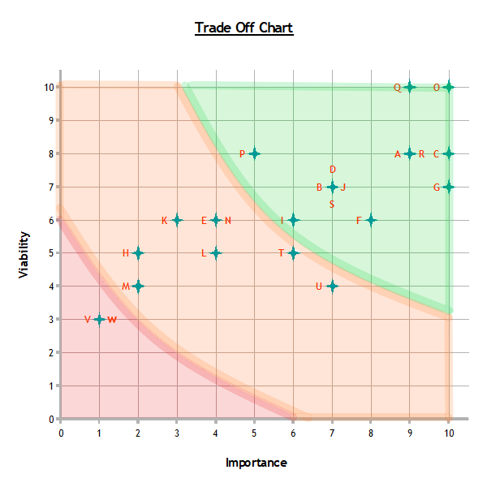

# Design Notes

General notes regarding the initial concept, layout and features of the Mastermind game application
#
## Strategy

- Who is it for?
  - **People who like logic games**
  - **People who want to see my coding capabilities**
- What content is relevant?
  - **Rules for the game**
  - **The game itself**
  - **A brief section on me as a developer**
- What else is available?
  - **Many other versions online**

  - What is good in those versions?
    - **Scaleable difficulty**
    - **Alert if selections not completed**
  - What is not good in those versions?
    - **Text heavy content**
    - **Very basic styling**
    - **Drag and drop controls**
    - **Unclear order of play**
- Why use my version?
  - **More appealing style/visual design**
  - **Clear layout**
  - **Variety of parameters that can alter difficulty**
  - **Relevant visual aids in rules**
  - **Click control system with positive user feedback**
#
### User Considerations

#### Audience

*The majority of users will fall into the consumer category, with that in mind, the site should allow quick access to the game. It should require minor input to view the rules and change the difficulty levels. 
The developer section will be more targeted toward the business category and so may involve a little more input from the user. It should maintain the style of the site but should also portray a slightly more professional approach with links to learn more if desired.*
#
#### User Reviews and Suggestions

*I asked a few people to advise on what they liked about current versions of the game that are available from other developers*
> "I like a little confirmation sound when I choose a colour or submit my answer"

> "I want to be able to click rather than drag and drop"

> "I like different difficulty settings"

> "I know how to play, please don't force me to the rules"

> "A lot of these logic games look a bit basic, it would be nice to see a little more style"

> "I don't want to waste a turn because I have forgotten to add all the colours"

> "I like to know my best score"

> "I enjoy trying to complete the game within a set number guesses"

> "I don't enjoy seeing a timer"

> "I like being offered a harder difficulty if I win"

> "I don't want to play with colours, how about some animals or symbols instead"
# 

### Rules

- Correctly identify the colours and the order of a number of coloured circles
- Correct colours in the wrong place generate a white peg response
- Correct colours in the correct place generate a black peg response
- Complete the correct colour and order to win
#
### Difficulties

- Number of coloured circles
- Number of possible colours
- Whether colours may be repeated within the solution
- Whether the player may repeat colour selections if the solution is not allowed repeats
- Limit number of attempts (challenge mode)
#
### Design Considerations

- Colour options
  - Contrast should be high enough that it doesn't cause confusion
  - Hovering over a colour could display its name for a visual aid
- Layout of game
  - Solution 'hidden' under a covering element which can animate away on correct solution/give up
  - Pegs responses should be aligned to make it clear which attempt they relate to
    - Pop up to explain the result? Hover/click result for more explanation?
  - Selecting a position should reveal possible colours to choose from
    - Remove already selected colours from choices or could be alerted with a pop-up depending on difficulty settings
- Brain image/favicon
- Display number of guesses
  - Fewest guesses to solution for current difficulty level
  - Reward for fewer guesses
- Display time to complete/average time per guess
  - Pause function (would need overlay to cover current game)
  - Ability to hide the timer
- Rules page
- Demo game page
- Challenge page
  - Standard challenge with 10 attempts, 6 colours and 4 slots
  - Extreme challenge with 6 attempts, 6 colours and 4 slots
    - Link to Donald Knuth algorithm
    - 6 attempts leaves room for one error
- About the developer page
#
### Importance/Viability Trade Offs

List of desired features and ability to deliver those features

| Desired Feature | Importance /10 | Viability /10 | Graph Reference |
| :---------------------: | :--------: | :-------: | :-------------: |
| Appealing design/visuals | 9/10 | 8/10 | a |
| Option to select number of colours | 7/10 | 7/10 | b |
| Option to select number of circles in solution | 10/10 | 8/10 | c |
| Option to select if colours may be repeated within solution | 7/10 | 7/10 | d |
| Option to repeat colours in guess if the solution has no repeats | 4/10 | 6/10 | e |
| Click control mechanism with revealing colour options | 8/10 | 6/10 | f |
| Display result of each guess | 10/10 | 7/10 | g |
| Pop up to remind meaning of results | 2/10 | 5/10 | h |
| Hidden solution that reveals on correct answer/give up | 6/10 | 6/10 | i |
| Score count | 7/10 | 7/10 | j |
| Best score display | 3/10 | 6/10 | k |
| Timers | 4/10 | 5/10 | l |
| Pause function | 2/10 | 4/10 | m |
| Option to hide timer during gameplay | 4/10 | 6/10 | n |
| Rules page | 10/10 | 10/10 | o |
| Demo game | 5/10 | 8/10 | p |
| Developer section | 9/10 | 10/10 | q |
| Stop guess if not all selections made | 9/10 | 8/10 | r |
| Challenge mode with a limited number of attempts | 7/10 | 7/10 | s |
| Offer an increment in difficulty when winning | 6/10 | 5/10 | t |
| Confirmation sounds | 7/10 | 4/10 | u |
| Alternative images to just using colours | 1/10 | 3/10 | v |
| Set a code for 'AI' to solve | 1/10 | 3/10 | w |

 

#
## Scope

