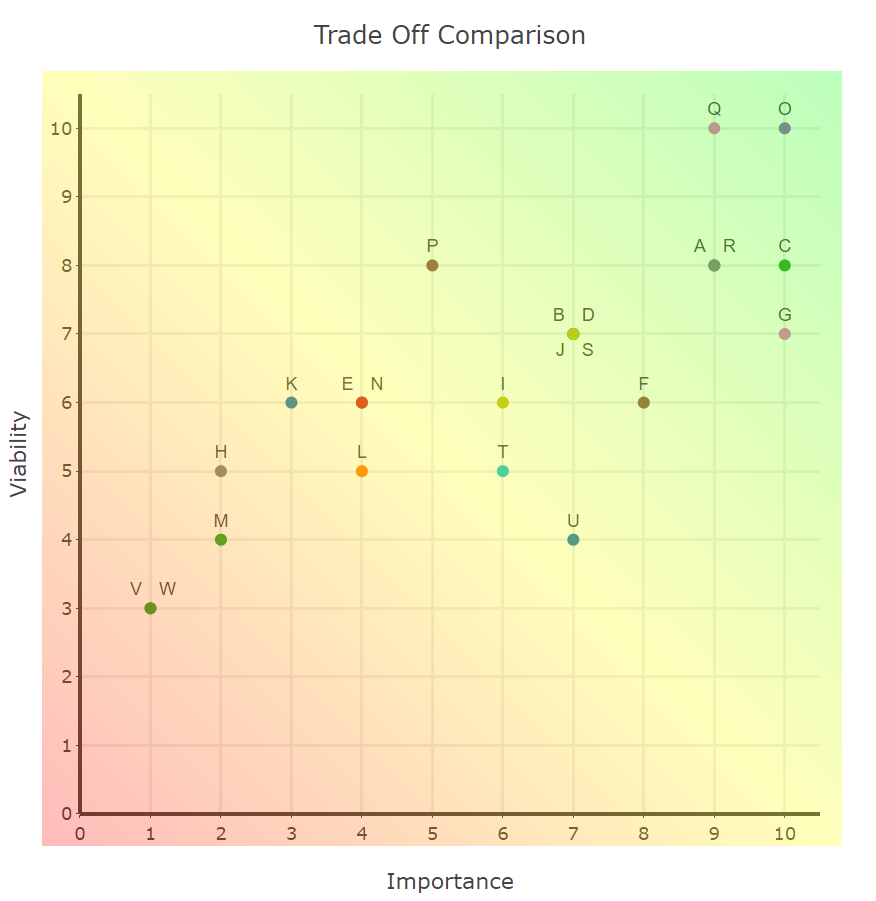

# Design Notes

General notes regarding the initial concept, layout and features of the Mastermind game application

---

## Strategy

- Who is it for?
  - People who like logic games
  - People who want to see my coding capabilities
- What content is relevant?
  - Rules for the game
  - The game itself
  - A brief section on me as a developer
- What else is available?
  - Many other versions online
  - What is good in those versions?
    - Scaleable difficulty
    - Alert if selections not completed
  - What is not good in those versions?
    - Text heavy content
    - Very basic styling
    - Drag and drop controls
    - Unclear order of play
- Why use my version?
  - More appealing style/visual design
  - Clear layout
  - Variety of parameters that can alter difficulty
  - Relevant visual aids in rules
  - Click control system with positive user feedback

---

### User Considerations

#### Audience

The majority of users will fall into the consumer category, with that in mind, the site should allow quick access to the game. It should require minor input to view the rules and change the difficulty levels.  
The developer section will be more targeted toward the business category and so may involve a little more input from the user. It should maintain the style of the site but should also portray a slightly more professional approach with links to learn more if desired.

---

#### User Reviews and Suggestions

I asked a few potential users of the game to advise on what they liked about current versions that are available from other developers

> "I like a little confirmation sound when I choose a colour or submit my answer"
>
> "I want to be able to click rather than drag and drop"
>
> "I like different difficulty settings"
>
> "I know how to play, please don't force me to the rules"
>
> "A lot of these logic games look a bit basic, it would be nice to see a little more style"
>
> "I don't want to waste a turn because I have forgotten to add all the colours"
>
> "I like to know my best score"
>
> "I enjoy trying to complete the game within a set number guesses"
>
> "I don't enjoy seeing a timer"
>
> "I like being offered a harder difficulty if I win"
>
> "I don't want to play with colours, how about some animals or symbols instead"

---

### Rules

- Correctly identify the colours and the order of a number of coloured circles
- Correct colours in the wrong place generate a white peg response
- Correct colours in the correct place generate a black peg response
- Complete the correct colour and order to win

---

### Difficulties

- Number of coloured circles
- Number of possible colours
- Whether colours may be repeated within the solution
- Whether the player may repeat colour selections if the solution is not allowed repeats
- Limit number of attempts (challenge mode)

---

### Design Considerations

- Colour options
  - Contrast should be high enough that it doesn't cause confusion
  - Hovering over a colour could display its name for a visual aid
- Layout of game
  - Solution 'hidden' under a covering element which can animate away on correct solution/give up
  - Pegs responses should be aligned to make it clear which attempt they relate to
    - Pop up to explain the result? Hover/click result for more explanation?
  - Selecting a position should reveal possible colours to choose from
    - Remove already selected colours from choices or could be alerted with a pop-up depending on difficulty settings
- Brain image/favicon
- Display number of guesses
  - Fewest guesses to solution for current difficulty level
  - Reward for fewer guesses
- Display time to complete/average time per guess
  - Pause function (would need overlay to cover current game)
  - Ability to hide the timer
- Rules page
- Demo game page
- Challenge page
  - Standard challenge with 10 attempts, 6 colours and 4 slots
  - Extreme challenge with 6 attempts, 6 colours and 4 slots
    - Link to Donald Knuth algorithm
    - 6 attempts leaves room for one error
- About the developer page

---

### Importance/Viability Trade Offs

List of desired features and ability to deliver those features

| Desired Feature | Importance /10 | Viability /10 | Graph Reference |
| :---------------------: | :--------: | :-------: | :-------------: |
| Appealing design/visuals | 9/10 | 8/10 | A |
| Option to select number of colours | 7/10 | 7/10 | B |
| Option to select number of circles in solution | 10/10 | 8/10 | C |
| Option to select if colours may be repeated within the solution | 7/10 | 7/10 | D |
| Option to repeat colours in guess if the solution has no repeats | 4/10 | 6/10 | E |
| Click control mechanism with revealing colour options | 8/10 | 6/10 | F |
| Display result of each guess | 10/10 | 7/10 | G |
| Pop up to remind meaning of results | 2/10 | 5/10 | H |
| Hidden solution that reveals on correct answer/give up | 6/10 | 6/10 | I |
| Score count | 7/10 | 7/10 | J |
| Best score display | 3/10 | 6/10 | K |
| Timers | 4/10 | 5/10 | L |
| Pause function | 2/10 | 4/10 | M |
| Option to hide timer during gameplay | 4/10 | 6/10 | N |
| Rules page | 10/10 | 10/10 | O |
| Demo game | 5/10 | 8/10 | P |
| Developer section | 9/10 | 10/10 | Q |
| Stop guess if not all selections made | 9/10 | 8/10 | R |
| Challenge mode with a limited number of attempts | 7/10 | 7/10 | S |
| Offer an increment in difficulty when winning | 6/10 | 5/10 | T |
| Confirmation sounds | 7/10 | 4/10 | U |
| Alternative images to just using colours | 1/10 | 3/10 | V |
| Set a code for 'AI' to solve | 1/10 | 3/10 | W |

---

  
[Trade Off Chart Javascript](./scatter.js)  
[Trade Off Chart HTML](./scatter.html)

---

## Scope

Considering the chart above I will focus on these elements as priorities:

- The game *(this isn't on the chart, but without it, there isn't much else!)*
- The rules page
- The developer page
- Designs/visuals
- Option to select number of colours
- Option to select number of circles in solution
- Option to select if colours may be repeated within the solution
- Click control mechanism
- Display results of each guess
- Score count
- Stop guess if not all selections made
- Challenge mode

As I have a fairly good timescale to work on the project, I would hope to work on the following elements too:

- Demo game
- Hidden solution that reveals on correct answer/give up
- Offer an increment in difficulty when winning
- Option to repeat colours in guess if the solution has no repeats
- Timers
- Option to hide timer during gameplay
- Best score display

The remaining elements are things that may take more time for me to develop. If I am able, I will include as many as possible:

- Confirmation Sounds
- Pause function
- Pop up to remind meaning of results

The final two elements are likely to take a little more research and could require a lot more time to refine. I will only attempt to include these if I am really ahead of schedule:

- Alternative images to just using colours
- Set a code for 'AI' to solve
  - *This would utilise the [Donald Knuth](https://en.wikipedia.org/wiki/Mastermind_(board_game)#Algorithms_and_strategies) 5 guess algorithm which, logically, I understand...I just imagine it would take me a while to write the scripts for it*

---

## Structure

The information architecture of the site should allow users to navigate easily between different pages. All pages should be accessible from each other, as the overall construct is not too complex, and the site will have just five pages.  
I am yet to decide whether there will be a welcome page. My initial thoughts are that users will enjoy being able to play immediately, with the option to explore further if desired. Pages will be easily accessible via a header element which will remain present at the top of the page.  
The interaction design will be styled in a way that maintains the user experience throughout. Navigation elements will remain in the same places, colour schemes and typography will remain consistent across the pages.  

---

## Skeleton

As the game has a few aspects to present on the page, I will adjust and simplify thing as necessary. The wireframe shown below has many comments attached which can be viewed in [*Blasamiq*](https://balsamiq.com/) and can be downloaded from the readme-content directory [here](./mastermind.bmpr)  

The game features will be designed to be as intuitive as possible, however, due to the quantity of important, items there will be detailed explanations with screenshots included in the rules page.

## Surface

<!-- Colour schemes -->
The classic version of this game is played in a wooden box construction. I will look at contrast viability of browns and see if I can maintain the classic look. If that seems improbable, I will research some more modern designs and look to give the game a more modern 'edgy' representation.
<!-- Typography -->
The game is logic based and so does not require any very fancy typography. I will aim to keep the font basic and clean to give good readability.
<!-- Imagery/design -->
With the game being of logic design, the image I intend to use as a logo should reference the human brain. Most other images will be generated through the development process via screenshots or snips. The design of the colour selections/positions should be maintained throughout and be kept simple and functional. The result pegs should also follow the simple and functional design aspects.  
I intend to use the Rubik's cube as a 'logo' for myself as a developer but need to look into the legality of this. If needed, I can use my own profile image on the 'about' page.

*Having worked on the site, I have decided not to use the Rubik's cube image as it may cause user confusion. I have used a profile image picture of myself as is customary with a brief 'about-me' section.*
<!-- The identity of the site -->
The identity of the site will be made through the design considerations listed above. One of the key aspects for the design is to make a more visually appealing and emotively rewarding game than I have found available from other developers.
